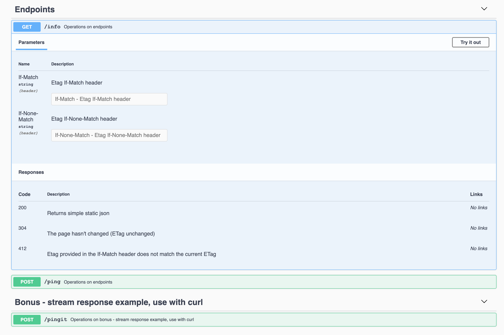
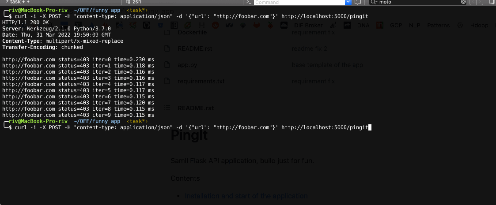

PingIt
=================

Samll Flask API application, build just for fun.

.. contents:: Contents

Installation and start of the application
----------------------

Installation is simple. Just run this command with *docker*:

.. code:: bash

    $ docker build --tag pingit .

Run application:

.. code:: bash

    $ docker run -p 5000:5000 pingit

Resolve 127.0.0.1:5000 in Your browser to get into API documentation

Simple CLI:
---------------------

set Flask_APP

.. code:: bash

    export FLASK_APP=app.py

Avaliable flask commands:

.. code:: bash
  run               Runs a development server.
  shell             Runs a shell in the app context.
  start-dev-server  Start development server.
  start-server      Start server.
  stop-server       Stop server.

Some examples:

Start Development Server

.. code:: bash

    flask start-dev-server

Start Server (using gunicorn)

.. code:: bash

    flask start-server

Stop Server (kill gunicorn processes)

.. code:: bash

    flask stop-server

Usage examples:
---------------------

Checking etag:

.. code:: bash

   curl -i http://localhost:5000/info
   HTTP/1.1 200 OK
   Server: Werkzeug/2.1.0 Python/3.7.0
   Date: Thu, 31 Mar 2022 19:38:25 GMT
   Content-Type: application/json
   Content-Length: 34
   ETag: "401f6fd4e83461d236a7399206c2e2d42e05f27b"
   Date: Thu, 31 Mar 2022 19:38:25 GMT

   {"Receiver": "Cisco is the best!"}

Checking if etag works:

.. code:: bash

   curl -i http://localhost:5000/info -H 'If-None-Match: 401f6fd4e83461d236a7399206c2e2d42e05f27b'                                                                                                                                                                       130 ↵
   HTTP/1.1 304 NOT MODIFIED
   Server: Werkzeug/2.1.0 Python/3.7.0
   Date: Thu, 31 Mar 2022 19:39:46 GMT
   ETag: "401f6fd4e83461d236a7399206c2e2d42e05f27b"
   Date: Thu, 31 Mar 2022 19:39:46 GMT
   Transfer-Encoding: chunked

Hit ping endpint example:

.. code:: bash

   curl -i -X POST -H "content-type: application/json" -d '{"url": "http://foobar.com"}' http://localhost:5000/ping
   HTTP/1.1 200 OK
   Server: Werkzeug/2.1.0 Python/3.7.0
   Date: Thu, 31 Mar 2022 19:40:50 GMT
   Content-Type: text/html; charset=utf-8
   Transfer-Encoding: chunked

   <html><head><title>Error 403 - Forbidden</title><head><body><h1>Error 403 - Forbidden</h1>
You don't have permission to access the requested resource. Please contact the web site owner for further assistance.
</body></html>

Stream response with *pingit* endpoint example:

